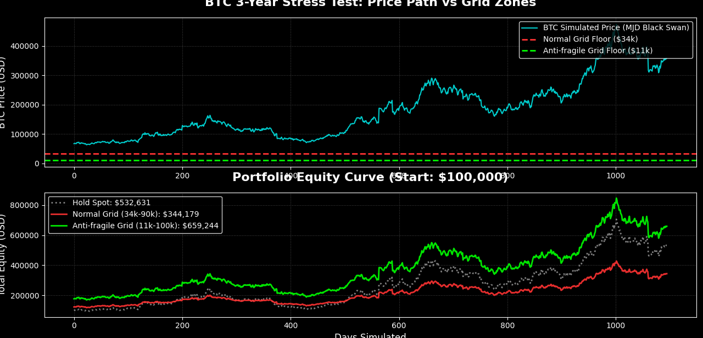

# BTC Tail-Risk Pricing: GBM vs. Merton Jump-Diffusion Monte Carlo Simulation


## 📌 Abstract
This repository contains a quantitative stress-test simulation for Bitcoin (BTC) price action over a 3-year horizon (1,095 days). It generates **10,000 Monte Carlo paths** to evaluate the mathematical probability of a "going to zero" scenario. 

Unlike conventional models that assume continuous log-normal distribution, this simulation juxtaposes standard continuous dynamics against **extreme tail-risk events** (e.g., macro liquidity crunches, exchange collapses, and liquidation cascades).

## 🧮 The Mathematical Models

### 1. Geometric Brownian Motion (GBM)
The standard model for asset pricing, assuming continuous paths and normally distributed returns.
* **SDE:** $dS_t = \mu S_t dt + \sigma S_t dW_t$
* **Limitation:** Fails to account for the "fat-tailed" nature of crypto markets (sudden, violent crashes).

### 2. Merton Jump-Diffusion (MJD)
To accurately price in crypto's structural fragility, we inject a Poisson jump process into the standard GBM. This simulates sudden, unpredictable black swan events.
* **SDE:** $dS_t = \mu S_t dt + \sigma S_t dW_t + S_t dJ_t$
* **Jump Parameters:** * $\lambda = 5$ (Assuming 5 systemic shocks per year)
  * $\mu_{jump} = -5\%$ (Asymmetric downside representing long-squeeze liquidations)
  * $\sigma_{jump} = 15\%$ (Extreme variance during the crash)

## 📊 Key Findings (Terminal Distribution)

Running the simulation against historical volatility yields the following percentile distribution after 3 years:

| Scenario | 5th Percentile (Tail-Risk Floor) | 50th Percentile (Median) | 95th Percentile (Euphoria) |
| :--- | :--- | :--- | :--- |
| **GBM (Continuous)** | ~$34,700 | ~$128,900 | ~$486,000 |
| **MJD (Black Swan)** | **~$11,100** | ~$60,800 | ~$326,000 |

**Conclusion:** Even under the most brutal volatility drag and repeated liquidation cascades, the mathematical floor (5th percentile) sits robustly at `$11k`. The probability of BTC reaching an absorbing state of absolute zero ($P(Zero) \to 0$) is structurally invalid. 

## ⚙️ Installation & Usage

Only standard data science libraries are required. No external API keys are needed for this standalone simulation.

```bash
pip install numpy matplotlib
## 📁 Research Modules & Backtest Engine

The `research/` directory contains the core mathematical models and stress-testing engines used to validate our trading logic:

* **`gbm_monte_carlo.py` (Baseline Market Pricing):** Simulates standard continuous market dynamics using Geometric Brownian Motion.
* **`mjd_stress_test.py` (Black Swan Tail-Risk Pricing):** Injects Poisson jump processes to evaluate the destructive power of macro liquidity crunches and liquidation cascades.
* **`btc_grid_backtest.py` (Anti-fragile Grid Backtest Engine):** A ruthless backtesting environment pitting standard grid trading against an "anti-fragile" wide-grid strategy under extreme market crashes.

### 📉 Stress-Test Visualization (The Mathematical Proof)
The chart below demonstrates the survival rate and equity curve of our **Anti-fragile Grid ($11k - $100k)** versus a normal grid and spot holding during a 3-year simulated MJD black swan event:

